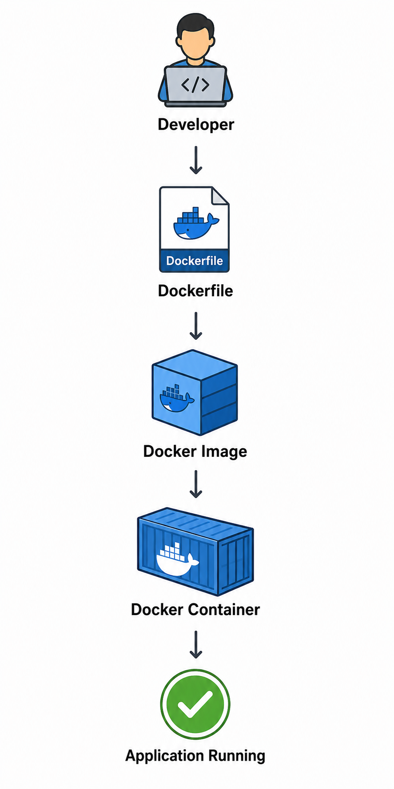

## Architecture

## Workflow

1. Developer creates Dockerfile.
2. Docker builds the image.
3. Docker runs the container.
4. Application becomes available.

### Technologies

- Docker
- Dockerfile
- Docker Image
- Docker Container

---